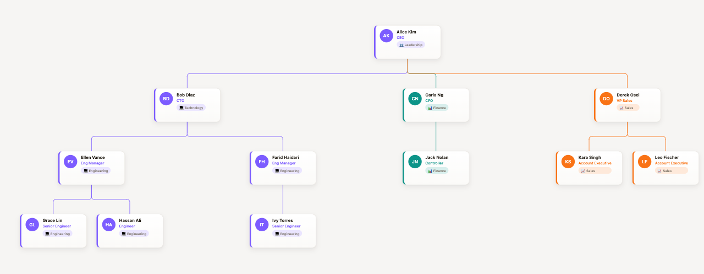
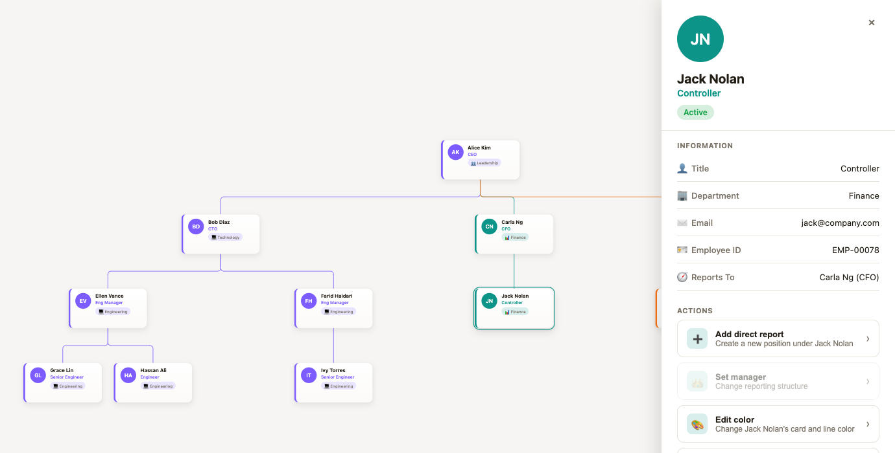

# core-innovate-tree — React Org Chart Component

[](https://www.npmjs.com/package/core-innovate-tree)
[](./LICENSE)
[](./src/core/types.ts)

A premium, JSON-driven **org chart** / **organization chart** component for **React** and **React Native** — pan/zoom navigation, a fully editable data model, per-branch colors and icons, and a printable details drawer. Use it to visualize company hierarchy, team structure, reporting lines, or an employee directory from your own data — no design work required.

```bash
npm install core-innovate-tree
```





**Contents:** [Quick start](#quick-start-web) · [Data model](#data-model) · [Where does data come from?](#where-does-data-come-from) · [Props](#orgchart-props) · [Editing](#editing-without-any-ui) · [Printing](#printing) · [Development](#development)

## Why this one

- **One package, two renderers.** `core-innovate-tree` (data model + layout engine), `core-innovate-tree/react` (web), `core-innovate-tree/native` (React Native) — the same JSON data model and mutation functions drive both.
- **You own the data.** `OrgChart` is a controlled component — you hold the JSON, the widget just renders it and reports changes. Feed it a static constant, a REST/GraphQL API, React Query, Redux — see [Where does data come from?](#where-does-data-come-from).
- **Real editing, not just display.** Add or remove people, set managers, recolor a branch, or drive the same pure functions headlessly from your own UI.
- **Looks designed, not default.** Per-person color and department icon, a tinted connector per branch, and a polished details drawer — out of the box, without hand-rolled CSS.
- **Click or hover a person** to open a right-side drawer with their details and a Print button.

## Quick start (web)

```tsx
import { useState } from 'react';
import { OrgChart } from 'core-innovate-tree/react';
import type { OrgChartData } from 'core-innovate-tree';

const initialData: OrgChartData = {
  people: [
    { id: 'george', name: 'George Hart', title: 'CEO' },
    { id: 'mary', name: 'Mary Hart', title: 'VP Engineering', managerId: 'george' },
    { id: 'john', name: 'John Hart', title: 'Engineer', managerId: 'mary' },
  ],
};

function App() {
  const [data, setData] = useState(initialData);
  return (
    <div style={{ width: '100vw', height: '100vh' }}>
      <OrgChart data={data} onChange={setData} editable printable />
    </div>
  );
}
```

## Quick start (React Native)

```tsx
import { GestureHandlerRootView } from 'react-native-gesture-handler';
import { OrgChart } from 'core-innovate-tree/native';

export default function App() {
  return (
    <GestureHandlerRootView style={{ flex: 1 }}>
      <OrgChart data={data} onChange={setData} editable printable />
    </GestureHandlerRootView>
  );
}
```

React Native additionally needs `react-native-svg`, `react-native-gesture-handler`, `react-native-reanimated`, and `expo-print` (or a bare-RN print library) installed in your app — see `example-native/`.

## Data model

```ts
interface Employee {
  id: string;
  name: string;
  title?: string;
  department?: string;
  photoUrl?: string;
  managerId?: string; // omit for a root, e.g. the CEO
  color?: string;       // any CSS color — tints this person's card, the line to their reports, and their drawer
  icon?: string;        // an emoji shown in the department chip, e.g. '💻' (only shown alongside `department`)
  status?: string;      // a short label shown as a pill in the drawer, e.g. 'Active'
  statusColor?: string; // any CSS color for the status pill — defaults to green when `status` is set
  customFields?: Record<string, unknown>; // anything else you want to show in the drawer
}

interface OrgChartData {
  people: Employee[];
  rootId?: string;
}
```

`color` and `icon` are entirely optional and per-person — there's no automatic "inherit my manager's color" behavior, so if you want a whole branch to share a color (as in the example app), set the same `color` on each person in that branch yourself. Omitting them keeps the neutral default look.

Each employee has at most one manager, so the chart is always a strict tree — no duplicate/merge handling needed. Multiple people with no `managerId` are rendered as separate root trees side by side (e.g. co-CEOs, or two independent org units in one chart).

## Where does `data` come from?

`<OrgChart>` is a fully controlled component — it doesn't fetch or store anything itself, so `data` can come from wherever you already keep state: a hardcoded constant, `useState`, Redux/Zustand, React Query, a WebSocket, etc. The widget just renders whatever `OrgChartData` you hand it and reports edits back through `onChange`.

The one thing worth calling out: most real org-chart APIs don't return this flat `{ id, managerId }` shape — they return a **nested** tree, `{ ...fields, children: [...] }`. `flattenTree` converts that shape for you:

```ts
import { useEffect, useState } from 'react';
import { flattenTree } from 'core-innovate-tree';
import type { OrgChartData } from 'core-innovate-tree';

function useOrgChartFromApi(url: string) {
  const [data, setData] = useState<OrgChartData | null>(null);

  useEffect(() => {
    fetch(url)
      .then((res) => res.json())
      .then((nested) => setData(flattenTree(nested)));
  }, [url]);

  return data; // null while loading — render a spinner/empty state until it resolves
}
```

`flattenTree` also accepts an array of roots (a forest), and generates an id for any node that arrives without one. See `example/src/ApiExample.tsx` for the full version with loading/error states.

### Photos (`photoUrl`)

`photoUrl` is a plain image URL — the widget doesn't fetch or manage it, it just renders `` (an `Image` on native), falling back to initials when it's unset *or* fails to load. That means wiring it up to your own system is just computing the right URL string when you build your `Employee[]`, the same way `color`/`icon` work:

```ts
// Your HR/identity system's raw record, in whatever shape it already comes in
const rawEmployees = await fetchFromHrSystem();

const people: Employee[] = rawEmployees.map((raw) => ({
  id: raw.employeeId,
  name: raw.fullName,
  managerId: raw.managerEmployeeId,
  // Most systems serve photos from a predictable URL built from an id, e.g.:
  photoUrl: `https://intranet.example.com/avatars/${raw.employeeId}.jpg`,
  // Or a hosted user-photo service keyed by email, e.g. Gravatar:
  // photoUrl: `https://www.gravatar.com/avatar/${md5(raw.email)}`,
}));
```

If your system's photos are behind auth (a bearer token, a signed session — not just a public URL), a plain ``/`Image` can't attach that header. Fetch the image yourself with your auth and pass the result as a `data:` URI or a temporary public/signed URL instead — `photoUrl` accepts any of those the same way, since it's just a string.

## `<OrgChart>` props

| Prop | Type | Description |
|---|---|---|
| `data` | `OrgChartData` | The chart to render. |
| `onChange` | `(data) => void` | Called with the next chart after an edit. Omit to render read-only. |
| `editable` | `boolean` | Shows Remove / Add relation controls in the drawer. |
| `printable` | `boolean` | Shows the Print button in the drawer (default `true`). |
| `drawerFields` | `DrawerField[]` | Which fields show in the drawer, and how. See below. |
| `renderNodeContent` | `(person, state) => ReactNode` | Fully replace a node's card with your own markup. |
| `onNodeClick` / `onNodeHover` | `(person \| null) => void` | Observe selection without controlling it. |
| `theme` | `Partial<OrgChartTheme>` | Override colors/fonts — see `defaultTheme`. |
| `layoutOptions` | `{ nodeWidth?, nodeHeight?, horizontalGap?, verticalGap? }` | Tune card size and spacing. |
| `minZoom` / `maxZoom` | `number` | Pan/zoom bounds. |

```ts
interface DrawerField {
  key: string;                 // looked up on the Employee, falling back to person.customFields[key]
  label: string;                // shown in the drawer
  icon?: string;                // an emoji shown next to the label, e.g. '✉️'
  render?: (person) => string;  // optional custom formatting
}
```

The drawer also shows a "Reports To" row automatically (the selected person's manager, looked up via `managerId`) — no field configuration needed, and it's omitted for anyone with no manager.

## Editing without any UI

Every mutation is a plain, immutable function in the core package — use them directly if you're building your own UI, or via the `useOrgChart` headless hook:

```ts
import { addPerson, removePerson, updatePerson, addRelationship, removeRelationship } from 'core-innovate-tree';
// or: const { data, addPerson, removePerson, updatePerson, addRelationship, removeRelationship } = useOrgChart(initialData);
```

`addRelationship({ type: 'manager-report', managerId, reportId })` rejects anything that would create a cycle in the management chain, and `removePerson(data, id, { cascade: true })` also removes that person's entire reporting chain rather than leaving orphaned reports behind. `updatePerson(data, id, updates)` merges any fields — name, title, color, icon, etc. — into an existing person; it's what powers the drawer's "Edit color"/"Edit icon" actions (`onEditPerson` on `<OrgChart>`), and a newly added report/manager automatically inherits the related person's `color`/`icon`/`department` rather than starting out gray.

## Printing

Clicking Print in the drawer renders that person's fields into a small, self-contained HTML document (shared between both platforms) and hands it to the platform's native print flow: a hidden `<iframe>` + `window.print()` on web, `expo-print` on React Native. Nothing from your app's stylesheet or the chart itself gets printed — only that one person's details.

## Packages in this repo

```
src/core/    — types, mutations, layout engine, print HTML generator (framework-agnostic)
src/react/   — the web renderer (built on react-zoom-pan-pinch for pan/zoom)
src/native/  — the React Native renderer (react-native-svg + gesture-handler + reanimated)
src/shared/  — the useOrgChart hook and other logic with zero DOM/RN dependency
example/     — a Vite app exercising the web renderer
example-native/ — an Expo app exercising the native renderer (run on a device/simulator to verify — not exercised by automated tests in this repo)
```

## Development

```bash
npm install
npm run build       # tsup — builds dist/, dist/react/, dist/native/
npm test            # vitest — core logic (mutations, layout, print HTML)
npm run typecheck   # tsc --noEmit across all three entries

cd example && npm install && npm run dev   # visually exercise the web renderer
```

Before publishing, verify the package actually resolves for a real installer (not a workspace symlink):

```bash
npm run build
npm pack --pack-destination /tmp
mkdir /tmp/pack-test && cd /tmp/pack-test && npm init -y
npm install /tmp/core-innovate-tree-*.tgz react react-dom
node -e "import('core-innovate-tree/react').then(m => console.log('OrgChart' in m))"
```
